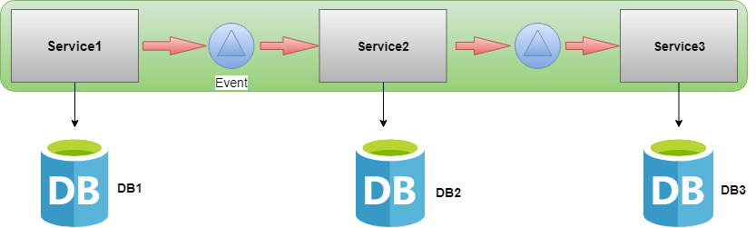

# Transacción en Microservicios

* Las transacciones deben ser atómicas, todo éxito o fracaso.
* La transacción en microservicios es una transacción distribuida. 
* Si en una transacción de un servicio falla, entonces se necesita de un mecanismo para revertir todas las transacciones anteriores.
* No hay forma de saber si una transacción se completo correctamente.

## Patrones

### Patrón 2pc (Compromiso de dos fases)

* Tiene dos fases una fase de preparación y una fase de confirmación.
* En la fase de preparación, se pedirá a todos los microservicios que se preparen para algún cambio de datos que podría realizarse de forma atómica.
* Una vez que todos los microservicios estén preparados, la fase de confirmación pedirá a todos los microservicios que realicen los cambios reales.
* Para implementar este patrón se necesita de un coordinador central para mantener el ciclo de vida de la transacción, y el coordinador deberá llamar a los microservicios en las fases de preparación y confirmación.
* Requiere mecanismos integrales de recuperación de fallas, con reintentos, repositorio de estado.

Pasos:

1. El usuario solicita una transacción.
2. El Coordinador crea una transacción global con toda la información de contexto.
3. Se indica al servicio 1 que se prepare para que los datos de la transacción se actualicen en su base de datos con la transacción creada.
4. El servicio 1 luego ejecutara su lógica comercial para validar si puede realizar su transacción.
5. Una vez que el servicio 1 esta listo para realizar el cambio, bloqueara el objeto en la base de datos (esto generaría problemas serios) de mas cambios y le dirá al coordinador que esta preparado.
6. Lo mismo sucede con el servicio 2.
7. Una vez que el coordinador ha confirmado que todos los microservicios están listos para aplicar sus cambios, les pedira que realicen los cambios solicitando un compromiso con la transacción.
8. Todos los objetos se desbloquearan una vez que la transacción se realice correctamente.

**Manejar la reversión:** Si en algun momento un solo microservicio no se prepara en la fase 1, el Coordinador abortara la transacción y comenzara el proceso de reversión.

#### Ventajas

* Garantiza la transacción atómica.
* La transacción terminará con todos los microservicios que regresan correctamente o todos los microservicios que no han cambiado.
* Al mismo tiempo, también garantiza el aislamiento de lectura y escritura . no es visible hasta que el coordinador confirma los cambios.

#### Desventajas

* Es sincrónico (bloqueo).
* El protocolo deberá bloquear el objeto que se cambiará antes de que se complete la transacción. Esto no está bien. En un sistema de base de datos, las transacciones tienden a ser rápidas, normalmente en 50 ms. Sin embargo, los microservicios tienen grandes retrasos con las llamadas RPC, especialmente cuando se integran con servicios externos como un servicio de pago o un servicio de inventario. El bloqueo podría convertirse en un cuello de botella en el rendimiento del sistema. Además, es posible que dos transacciones se bloqueen mutuamente (punto muerto) cuando cada transacción solicita un bloqueo en un recurso que la otra requiere.
*  No es adecuado para la arquitectura de servicios de espejo debido a su desventaja anterior.

### Patrón Saga

* Es una secuencia de transacciones locales donde cada transacción actualiza datos dentro de un solo servicio.
* La primera transacción se inicia mediante una solicitud externa correspondiente a la operación del sistema, y luego cada paso posterior se activa al completar el anterior.

#### Tipos de patrones de Saga

1. **Eventos / Coreografía:** Se basa en eventos, cada servicio produce y escucha los eventos de otro servicio y decide si se debe tomar una acción o no.
2. **Comando / Orquestación:** Se basa en comando / respuesta, cuando un coordinador de servicios es responsable de centralizar la toma de decisiones de la saga y secuenciar la lógica empresarial.

#### Patrón Evento / Coreografía de microservicios.

* Se basa en el modelo impulsado por eventos.
* El primer servicio ejecuta una transacción y luego publica un evento.
* Este evento es escuchado por uno o mas servicios que ejecutan transacciones locales y publican (o no eventos) nuevos.

**Pasos:**

1. El servicio 1 completa su transacción local y publica el evento de éxito.
2. El servicio 2 escucha este evento y, en función del evento éxito, completa su transacción local.
3. El servicio 2 luego publica su evento de éxito y el servicio 3 escucha este evento y completa su transacción local.
4. Como el servicio 3 completa su transacción local y no publica un evento, en este punto se considera que la transacción distribuida entre servicios se completo con éxito.

#### Reversión de transacciones

* En caso de falla de la transacción, se lleva a cabo otra transacción  que compensa la transacción exitosa anterior a su estado original.
* Podría haber dos casos de uso de errores de transacción.

**Caso 1:** El error de transacción en el primer servicio es muy sencillo de manejar. En este caso, el servicio 1 revertirá su transacción local y no publicara ningún evento. 

**Caso 2:** La falla una transacción en el medio o en el ultimo punto de servicio necesita algún mecanismo adicional para manejarla.

Por ejemplo:

1. La transacción tiene éxito en el servicio 1 y en el servicio 2, pero fallo en el servicio 3.
2. En este punto el servicio 3 publicara los eventos de falla de la transacción. Los servicios anteriores, servicio 1 y servicio 2 escucharan este evento de falla. 
3. Una vez que los servicios escuchen el evento de falla, comenzara la transacción del compensador y revertirá la transacción anterior.
4. El mismo proceso se aplica cuando falla la transacción del ultimo servicio.

Otras opciones

Puede crear una solución más sólida mediante la comunicación asincrónica. Enviar un mensaje a una cola, un servicio de consumidor de cola podría procesar el mensaje, realizar los cambios en la base de datos en una sola transacción.
